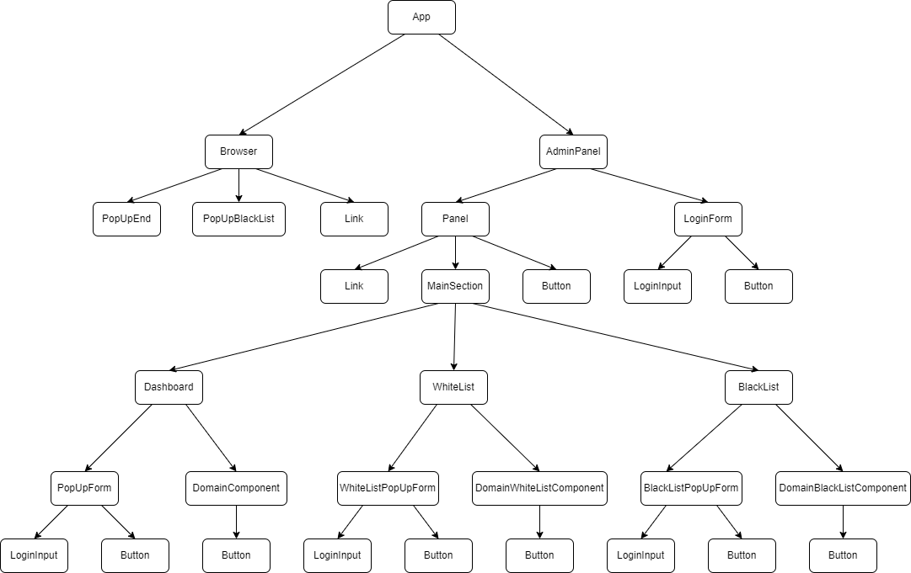

# Times Up
This is an application created as a final project of the JavaScript Developer course at Coders Lab - IT School. The application is used to control time and access for selected websites.

## Quick start
You need Node.js version *18.12.1* to run the project. In the project directory, first open a terminal and type npm install. Then, after installing the dependencies, type npm start. The site will launch at localhost:3001 and display our fake browser.

## List of sample pages
- http://gotowaniezpasja.pl/
- http://funfabryka.pl/
- http://www.nieborow.art.pl/
- http://urbandance.pl/
- http://www.aps.edu.pl/
- http://www.sporty-walki.org/

Unfortunately, not every website will work on our fake browser because modern websites block this type of activity.

## Main end points
`/` - fake browser - to browse selected websites \
`/panel` - main panel - to manage time and access to pages viewed in our fake browser

## Component hierarchy

`App` - main application component, includes routing to *Browser* and *AdminPanel* \
`Browser` - fake browser built on iframe, contains all the blocking and timekeeping logic \
`PopUpEnd` - popup with a message about the finite time for viewing the site, after disabling it moves to /panel \
`PopUpBlackList` - popup with a message about a banned site, when disabled, redirects to / \
`Link` - React component, works like  in HTML \
`AdminPanel` - contains the logic of logging in and keeping the user logged in in memory, when the user is logged in moves to the *Panel* component, and otherwise to *LoginForm* \
`Panel` - renders the main layout of the panel, determines the content rendering *MainSection* \
`MainSection` - renders *Dashboard*, *BlackList* or *WhiteList* depending on props given in *Panel* \
`Dashboard` - view to manage domains and their stay and break times \
`PopUpForm` - popup containing data to be completed: url, access time and break length \
`LoginInput` - input for entering a value with the field description as label \
`Button` - button as DIV \
`DomainComponent` - a record showing the domain with set access times and breaks \
`WhiteList` - view to manage domains without keeping track of time \
`WhiteListPopUpForm` - popup in *WhiteList* to complete the url field \
`DomainWhiteListComponent` - a record showing the domain without time limits \
`BlackList` - view for managing domains not allowed \
`BlackListPopUpForm` - popup in *BlackList* to complete the url field \
`DomainBlackListComponent` - record showing the blocked domain \
`LoginForm` - login form

## Licence
GNU GPL v3

## TODO list
-[ ] Add logic and view to statistics in panel
-[ ] Add set default time to use and time break 
-[ ] Add validation for all input boxes like: url, number, etc.
-[ ] Add titles for *MainSection* 

## Used public icons
- [Settings icons created by Freepik - Flaticon](https://www.flaticon.com/free-icons/settings) 
- [Rubbish Bin icon by SVG Repo](https://www.svgrepo.com/svg/78963/rubbish-bin) 
- [Close icon by Pixlok](https://pixlok.com/icons/close-icon-svg-free-download-3/)